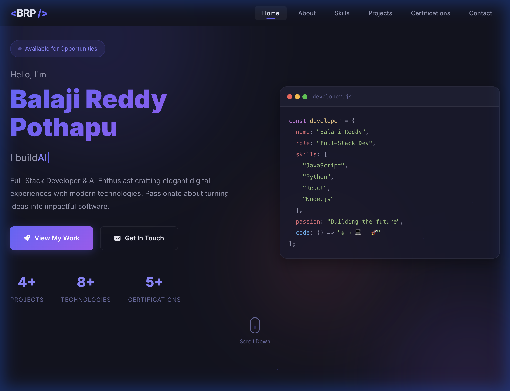
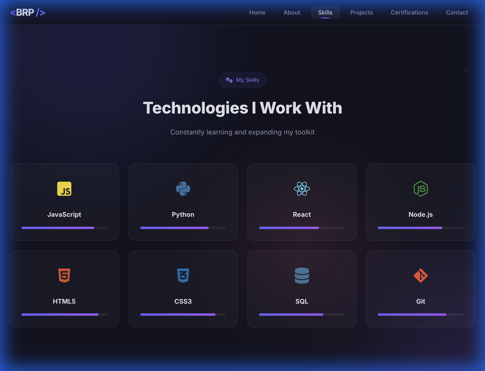

# 🌐 Portfolio Website

A stunning personal portfolio website with a premium dark glassmorphism design, smooth animations, and fully responsive layout.

## ✨ Features

- **Animated Hero** with typewriter effect and floating particles
- **Code Window** showcase with syntax highlighting
- **Glassmorphism** cards with hover effects
- **Skill Progress Bars** with scroll-triggered animation
- **Project Gallery** with overlay links
- **Contact Form** with mailto integration
- **Fully Responsive** — works on desktop, tablet, and mobile
- **Smooth Scroll** navigation with active states

## 🛠️ Tech Stack

| Technology | Purpose |
|-----------|---------|
| HTML5 | Structure & SEO |
| CSS3 | Glassmorphism, Grid, Animations |
| JavaScript | Interactivity & Animations |
| Font Awesome | Icons |
| Google Fonts | Inter & Fira Code Typography |

## 🚀 Getting Started

1. Clone the repository:
```bash
git clone https://github.com/Balajireddypothapu/portfolio-website.git
cd portfolio-website
```

2. Open `index.html` in your browser — no build tools needed!

## 📸 Screenshots

### Hero Section


### Skills & Technologies


## 📜 License

MIT License — feel free to use and customize!
